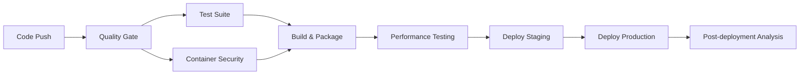

# 🚀 CI/CD Pipeline Documentation

## Overview
This repository implements a comprehensive CI/CD pipeline demonstrating SRE best practices, security scanning, automated testing, and reliable deployment strategies.

## Pipeline Features

### 🔍 Quality Gate
- **Code Formatting**: Black, isort
- **Linting**: Flake8, Pylint
- **Type Checking**: MyPy
- **Security Scanning**: Bandit (SAST), Safety (dependency vulnerabilities)
- **Documentation**: Automated report generation

### 🧪 Testing Strategy
- **Unit Tests**: Fast, isolated tests with coverage reporting
- **Integration Tests**: End-to-end testing with real database
- **Performance Tests**: K6 load testing with SLA validation
- **Smoke Tests**: Post-deployment health verification

### 🛡️ Security & Compliance
- **Container Scanning**: Trivy vulnerability assessment
- **Dockerfile Linting**: Hadolint best practices
- **Dependency Scanning**: Automated vulnerability detection
- **SARIF Reports**: GitHub Security tab integration

### 🏗️ Build & Deployment
- **Multi-platform**: AMD64 + ARM64 container builds
- **Registry**: GitHub Container Registry (GHCR)
- **Staging**: Automated deployment with health checks
- **Production**: Manual approval with comprehensive monitoring

### 📊 Monitoring & Observability
- **Metrics**: Prometheus + Grafana dashboards
- **Health Checks**: Comprehensive service validation
- **Deployment Tracking**: Automated logging and reporting
- **Rollback**: Automatic failure recovery

## Workflow Triggers

### Automatic Triggers
```yaml
on:
  push:
    branches: [main, develop, feature/*]
  pull_request:
    branches: [main, develop]
```

### Manual Triggers
```yaml
workflow_dispatch:
  inputs:
    environment: [staging, production]
```

## Environments

### 🧪 Staging Environment
- **Purpose**: Pre-production testing and validation
- **Access**: Automated deployment on main branch
- **Features**: Debug logging, extended monitoring
- **URL**: `https://staging.payment-platform.demo`

### 🏭 Production Environment
- **Purpose**: Live production deployment
- **Access**: Manual approval required
- **Features**: Optimized performance, security hardening
- **URL**: `https://payment-platform.demo`

## Pipeline Stages



## Security Features

### 🔐 Dependency Management
- Automated vulnerability scanning with Safety
- SPDX SBOM generation
- License compliance checking

### 🛡️ Container Security
- Base image vulnerability scanning
- Dockerfile best practices validation
- Runtime security policy enforcement

### 🔍 Code Security
- Static application security testing (SAST)
- Secrets detection and prevention
- Security-focused linting rules

## Performance Standards

### 📊 SLA Requirements
- **Response Time**: 95th percentile < 500ms
- **Availability**: 99.9% uptime target
- **Error Rate**: < 0.1% failure rate
- **Throughput**: > 1000 requests/second

### ⚡ Load Testing
- Automated K6 performance tests
- Stress testing up to 200 concurrent users
- Performance regression detection
- Capacity planning metrics

## Development Workflow

### 1. Feature Development
```bash
git checkout -b feature/new-payment-method
# Make changes
git commit -m "feat: add new payment method"
git push origin feature/new-payment-method
```

### 2. Pull Request
- Automated quality checks run
- Security scans execute
- Tests validate functionality
- Code review required

### 3. Merge to Main
- Full CI/CD pipeline executes
- Staging deployment automatic
- Production deployment requires approval

## Local Development

### Setup
```bash
# Copy environment template
cp .env.example .env

# Start development environment
docker-compose up -d

# Run tests locally
pytest tests/ --cov=services
```

### Quality Checks
```bash
# Run all quality checks
black .
isort .
flake8 .
mypy services/
bandit -r services/
safety check
```

## Monitoring & Alerting

### 📊 Dashboards
- **Grafana**: Application metrics and business KPIs
- **Prometheus**: System metrics and alerting rules
- **Jaeger**: Distributed tracing (optional)

### 🚨 Alerting Rules
- High error rate (> 1%)
- Increased response time (> 1s P95)
- Low success rate (< 99%)
- Resource exhaustion warnings

## Troubleshooting

### Common Issues

#### Pipeline Failures
```bash
# Check logs in GitHub Actions
# Download artifacts for detailed reports
# Review security scan results
```

#### Deployment Issues
```bash
# Check service health
curl http://localhost:8000/health

# View container logs
docker-compose logs payment-service

# Check metrics
curl http://localhost:8000/metrics
```

### Recovery Procedures

#### Automatic Rollback
- Failed health checks trigger automatic rollback
- Previous container version restored
- Monitoring alerts sent to team

#### Manual Rollback
```bash
# Emergency rollback
docker-compose down
git checkout <previous-commit>
docker-compose up -d
```

## Best Practices

### 🔧 Configuration Management
- Environment-specific configurations
- Secrets management via GitHub Secrets
- Feature flags for gradual rollouts

### 📝 Documentation
- Automated API documentation
- Deployment runbooks
- Incident response procedures

### 🔄 Continuous Improvement
- Pipeline metrics collection
- Performance trend analysis
- Regular security updates

## Contributing

### Pipeline Updates
1. Test changes in feature branch
2. Update documentation
3. Get team review
4. Deploy to staging first
5. Monitor metrics before production

### Adding New Checks
1. Add to appropriate pipeline stage
2. Set appropriate failure thresholds
3. Document new requirements
4. Train team on new processes

---

## 📞 Support

For pipeline issues or questions:
- **Documentation**: Check this README
- **Issues**: GitHub Issues tab
- **Monitoring**: Grafana dashboards
- **Logs**: GitHub Actions workflow runs
